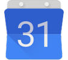

<!-- README.md is generated from README.Rmd. Please edit that file. -->


googlecalendar: Google Calendar for R
=====================================

**googlecalendar** makes Google Calendar easily accessible through R. The package offers a collection of functions for accessing and modifying calendars, events, and UI settings via Google's [Calendar API](https://developers.google.com/google-apps/calendar/). While not a verbatim port of available methods, the package aims to provide intuitive commands for interacting with the Calendar service.

This project is inspired in part by [googlesheets](https://github.com/jennybc/googlesheets), a Google Sheets interface for R. googlesheets is a wonderful project, and this package attempts to mirror its ease of use. Most notably, googlecalendar has been designed with a similar ambition for compatability with the [magrittr](https://github.com/smbache/magrittr) `%>%` pipe operator.

Under the hood, googlecalendar uses the [httr](https://github.com/hadley/httr) and [jsonlite](https://github.com/jeroenooms/jsonlite) packages for administering HTTP requests and coercing responses.

Development Note
----------------

This project is still very much in an early development stage. Not only is ~~a great deal of~~ most functionaly still missing, but virtually no tests have been formalized. All the same, feel free to share any initial feedback on the project via the [GitHub Issues](https://github.com/benjcunningham/googlecalendar/issues) page while we work to stabilize the package API and round out its basic functionality.

Installation & Setup
--------------------

To install the current development version:

``` r
devtools::install_github("benjcunningham/googlecalendar")
```

To use googlecalendar, you will need access to a Google Calendar API client key and secret. To obtain these, visit the [Google Developers Console](https://console.developers.google.com/) and register a new application. Once you have generated a key and secret, you can set them for persistent use in an `.Rprofile` file:

``` r
options(
  googlecalendar.client_key = "<KEY>",
  googlecalendar.client_secret = "<SECRET>"
)
```

Every function in this package that sends a request to the Google Calendar API must also include an authorization token. Fortunately, in almost all cases, the OAuth 2.0 process is evoked internally. However, you can use the following method to manually initialize the process:

``` r
library(googlecalendar)
gc_auth(new_user = TRUE)
```

From here, you will be automatically redirected to your web browser and asked to sign-in and grant permission for googlecalendar to access the Google Calendar API on your behalf. A similar mechanism will trigger when a network function is called without previously authorizing the application. When an access token becomes stale, the next function to make a request to the Calendar service will automatically handle fetching a new one without reinitializing the full authentication procedure (i.e. browser-based logins should happen only once per session). Note that googlecalendar currently only handles credentialling of one user at a time.

To deauthorize the current user and permanently remove their cached credentials:

``` r
gc_deauth(clear_cache = TRUE)
```

Usage
-----

More to come soon...
